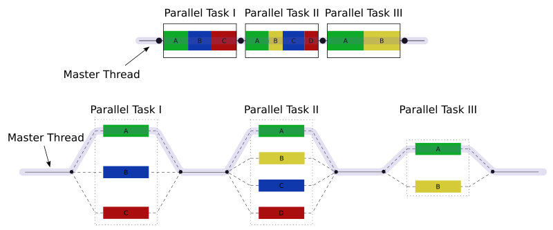

# 06 - Introdução a OpenMP

OpenMP é uma tecnologia de computação multi-core usada para paralelizar programas de modo facilitado. Ele é ideal para programar programas que usem o modelo *fork-join* que estudaremos nesta primeira parte do curso. 


Fonte: https://en.wikipedia.org/wiki/File:Fork_join.svg


# Parte 0 - primeiros usos

Nesta parte do roteiro usaremos 4 chamadas do OpenMP para recriar o primeiro exemplo da aula passada. 

1. `#pragma omp parallel` cria um conjunto de threads. Deve ser aplicado acima de um bloco de código limitado por `{  }`
2. `int omp_get_num_threads();` retorna o número de threads criadas (dentro de uma região paralela)
3. `int omp_get_max_threads();` retorna o número de máximo de threads (fora de uma região paralela)
4. `int omp_get_thread_num();` retorna o id da thread atual (entre 0 e o valor acima, dentro de uma região paralela)

O código abaixo (*exemplo1.c*) ilustra como utilizar OpenMP para fazer o exercicio 1 do roteiro anterior (criar 4 threads e imprimir um id de 0 a 3).

```cpp
--8<--- "06-intro-openmp/exemplo1.cpp"
```

Perceba que a principal utilidade do OpenMP é facilitar a programação quando todas as threads rodam o mesmo programa e a criação de threads e a junção de seus resultados ocorre de maneira frequente no programa. 

!!! example
    Compile o programa abaixo usando a seguinte linha de comando e rode-o.

    > `$ g++ -O3 exemplo1.cpp -o exemplo1 -fopenmp`

!!! question short
    O OpenMP permite alterar o número máximo de threads criados usando a variável de ambiente `OMP_NUM_THREADS`. Rode `exemplo1` como abaixo.

    > `OMP_NUM_THREADS=2 ./exemplo1` 

    Os resultados foram os esperados? Rode agora sem a variável de ambiente. Qual é o valor padrão assumido pelo OpenMP? É uma boa ideia usar mais threads que o valor padrão?

A utilização de `OMP_NUM_THREADS` ajuda a realizar testes de modo a compreender os ganhos de desempenho de um programa conforme mais threads são utilizadas. 

# Parte 1 - funcionalidades do OpenMP

Vamos continuar usando o exemplo *pi-numeric-integration.cpp* neste roteiro. Iremos comparar nosso programa da aula passada com implementações usando OpenMP. 


!!! example

    Refatore sua implementação da aula passada para que todo seu código usando threads esteja disponível em um função `double_pi_threads_raiz(long steps)` e que o código original esteja em uma função `double pi_seq(long steps)`.

!!! example 
    Chame ambas funções no `main` e compare seus resultados e o tempo necessário para cada uma rodar. 

!!! note
    Verifique que a versão usando threads demora um quarto do tempo da versão sequencial.

Vamos agora fazer um primeiro teste usando OpenMP. No exercício abaixo vamos somente substituir a criação das threads usando `<threads>` pela criação usando diretivas do OpenMP.

!!! example
    Crie uma função `double pi_omp_parallel(long steps)` que faça o cálculo do pi de modo paralelo usando `#pragma omp parallel`. Siga a mesma receita do seu programa usando threads:

    1. As iterações do `for` são divididas por igual entre as threads;
    1. Cada thread acumula seus resultados parciais armazenados em um vetor `double sum[]`. Para efeitos de exercício, use a construção `sum[id] +=`
    1. No fim os resultados parciais são usados para o cálculo final.

    Adicione uma chamada a esta função no `main` e mostre seu resultado e o tempo gasto. 

Já vimos que acessar a mesma variável (ou posição em um vetor) resulta em resultados incorretos. Por questões de cache, escrever em posições vizinhas de um vetor resulta em desempenho longe do ideal. Podemos arrumar isto criando uma variável local para acumular a soma e só escrever seu resultado no vetor `double sum[]` no fim.

!!! example 
    Crie uma função `double pi_omp_parallel_local(long steps)` que, ao invés de fazer `sum[id] +=` use uma variável local para guardar a soma e faça a atribuição somente no fim da seção paralela. 

    Como antes, adicione uma chamada ao `main` e verifique se houve ganho de desempenho. 

## Sincronização

O OpenMP nos permite eliminar o vetor `double sum[]` usando diretivas de sincronização de alto nível. As duas mais simples são `atomic` e `critical`.

A diretiva `atomic` executa uma atribuição ou uma operação aritmética *inplace* (`+=, -=, *=, /=`) garantindo que ela será concluída mesmo se outros cores tentarem fazê-la. 

!!! question short
    Como você poderia eliminar o vetor `double sum[]` usado nos exercícios anteriores usando `atomic`?

!!! example
     Faça uma função `double pi_omp_parallel_atomic(long steps)` usando esta diretiva, adicione-a no `main` e mostre seu resultado e o tempo gasto. Deverá haver ganho de desempenho.

A diretiva `critical` é aplicada a um bloco e faz com que ele esteja em execução em no máximo 1 das threads. Este nome vem do conceito de *seção crítica*, que representa uma seção de uma tarefa que não pode ser paralelizada de jeito algum e obrigatoriamente deve ser executada de modo sequencial. O uso de `critical` é muito perigoso, pois ao forçar a execução sequencial de um bloco de código podemos estar efetivamente matando o paralelismo do nosso programa. A construção `atomic` é uma seção crítica de apenas uma linha e usa suporte do hardware para rodar. A construção `critical` permite serializar várias linhas de código, mas exige suporte do Sistema Operacional e é bastante lenta. 

!!! example
    Faça uma função `double pi_omp_parallel_critical(long steps)` usando esta diretiva, adicione-a no `main` e mostre seu resultado e o tempo gasto. A implementação correta deverá ficar praticamente igual ao `atomic`.

!!! example
    Vamos agora fazer uma implementação errada de `critical`. Na versão anterior usamos uma variável local para cada armazenar os resultados parciais de cada thread. Troque seu uso para  armazenar na variável de fora da seção paralela usando `critical`. Chame esta função de `double pi_omp_parallel_critical_errado(long steps)`. Adicione-a no `main` e mostre seu resultado e o tempo gasto. O resultado final deverá ser pior que suas outras versões. 


Neste momento você deve ter obtido um programa com desempenho ao menos cerca de 50% mais rápido que o programa original. Mais importante, seu programa agora é muito mais simples de ler (e escrever) do que usando diretamente `std::thread`. Na próxima aula veremos como simplificar ainda mais estes códigos usando construções de alto nível do OpenMP.

